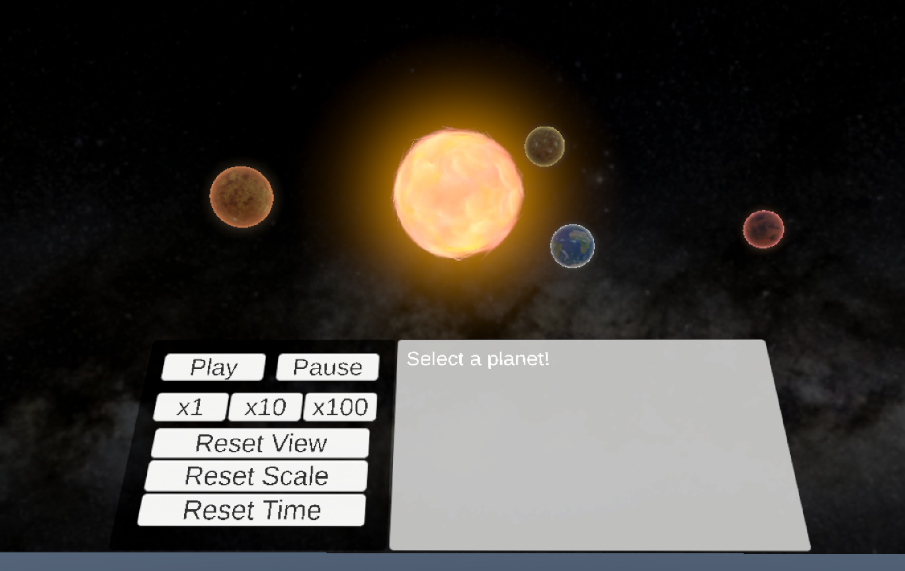
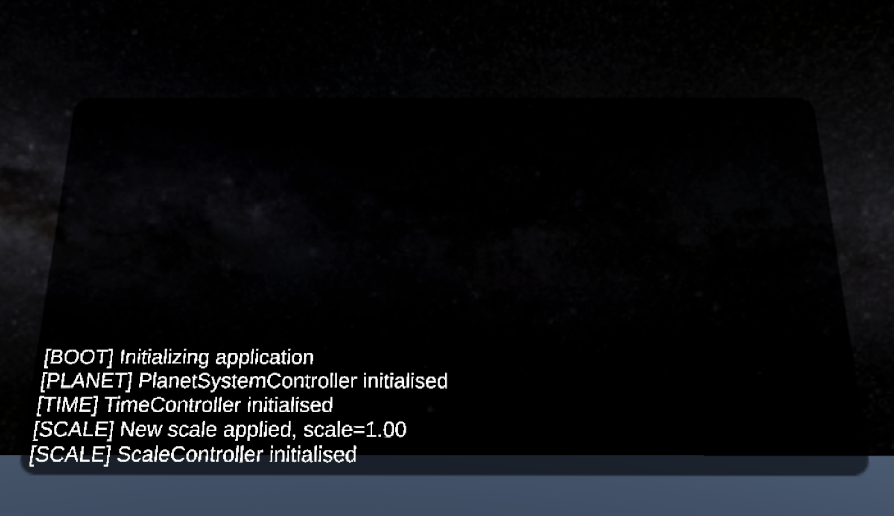

# VR Solar System

This project is a VR solar system workbench implemented in Unity, using C# and the OpenXR toolkit.

*Screenshot of the control panel, informations panel and solar system.*

*Screenshot of the debug panel*

## GitHub Link

https://github.com/lroliver03/VR-solar-system

## TODO

- Scheme of TimeModel -> Controller -> PlanetView
- Schemes of architecture